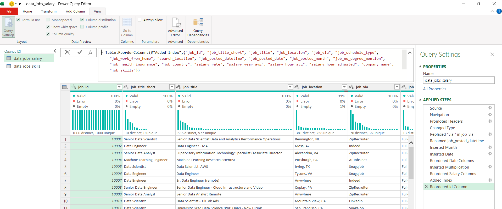
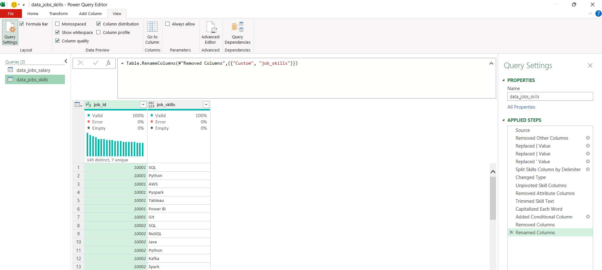

# Excel Project Analysis for Data Careers

## Table of Contents

1. [Introduction](#introduction)  
2. [Do More Skills Get You Better Pay?](#do-more-skills-get-you-better-pay)  
3. [What’s the Salary for Data Jobs in Different Regions?](#whats-the-salary-for-data-jobs-in-different-regions)  
4. [What Are the Top Skills of Data Professionals?](#what-are-the-top-skills-of-data-professionals)   
5. [What’s the Pay of the Top 10 Skills?](#whats-the-pay-of-the-top-10-skills)  
6. [Conclusion](#conclusion)

## Introduction

Navigating the data science job market can be challenging, especially when trying to identify which skills truly drive better opportunities and higher pay. This project explores real-world job data to uncover trends in salaries, regional differences, and in-demand skills for data professionals.

### Questions to Analyze

To understand the data science job market, I asked the following:

1. **Do more skills get you better pay?**  
2. **What’s the salary for data jobs in different regions?**  
3. **What are the top skills of data professionals?**  
4. **What’s the pay for the top 10 skills?**

### Excel Skills Used

The following Excel tools and techniques were used in this analysis:

- **Pivot Tables**  
- **Pivot Charts**  
- **DAX (Data Analysis Expressions)**  
- **Power Query**  
- **Power Pivot**

### Dataset Overview

This project utilizes a dataset containing real job listings and salary information from data-related roles in 2023. It includes key insights into:

- **Job titles**  
- **Salaries**  
- **Locations**  
- **Skills**

## 1. Do more skills get you better pay?

### Skill: Power Query (ETL)

#### Extract

I began by using Power Query to extract the original data (`data_jobs_salary_all.xlsx`) and create two queries:

- One containing all job listing details.
- Another mapping each job ID to its listed skills.

#### Transform

Each query was cleaned and transformed by:

- Changing column data types, removing unnecessary columns, standardizing and cleaning text, trimming excess whitespace.

    - `data_jobs_salary`   

        

    - `data_job_skills`      

        

#### Load

- Both transformed queries were loaded into the workbook to support the analysis:

    - `data_jobs_salary`    
        
        

    - `data_job_skills`

        

### Analysis

#### Insights

- There is a positive correlation between the number of skills listed in job postings and the median salary — especially for roles like **Senior Data Engineer** and **Data Scientist**.
- Positions requiring fewer skills, such as **Business Analyst**, tend to offer lower salaries, indicating that specialized skill sets are often rewarded with higher compensation.  

  

#### Why It Matters

- This trend highlights the advantage of developing a broader skill set — particularly for professionals targeting higher-paying roles in data.

## 2. What’s the salary for data jobs in different regions?

### Skills: PivotTables & DAX

#### Pivot Table

- Built a PivotTable using the Data Model created with Power Pivot.  
- Placed `job_title_short` in the Rows area and `salary_year_avg` in the Values area.  
- Added a new measure to calculate the **median salary** for jobs in the United States:

    ```DAX
    =CALCULATE(
        MEDIAN(data_jobs_salary[salary_year_avg]),
        data_jobs_salary[job_country] = "United States")
    ```

#### DAX

- To calculate the median annual salary across all roles, the following DAX measure was used:

    ```DAX
    Median Salary := MEDIAN(data_jobs_salary[salary_year_avg])
    ```

### Analysis

#### Insights

- Roles such as Senior Data Engineer and Data Scientist offer higher median salaries both in the U.S. and internationally — a sign of consistent global demand for advanced data roles.
- There's a noticeable salary gap between U.S. and non-U.S. positions, especially in tech-centric roles, potentially reflecting the influence of the U.S. tech industry's size and demand.    

    
    
#### Why It Matters

- These findings can guide salary benchmarking and job search strategies by accounting for regional pay differences — crucial for both professionals and employers navigating a global talent market.

## 3. What are the top skills of data professionals?

### Skill: Power Pivot

#### Power Pivot

- Built a data model by integrating the `data_jobs_salary` and `data_jobs_skills` tables.  
- Since the data had already been cleaned in Power Query, Power Pivot was able to automatically establish a relationship between the two tables.

#### Data Model

- A relationship was created between the tables using the `job_id` column.    <

    
    
#### Power Pivot Menu

- The Power Pivot interface was used to refine the model and simplify the creation of new measures.

    
    
---

### Analysis

#### Insights

- **SQL** and **Python** are by far the most commonly mentioned skills in data-related job postings, each appearing in over 50% of listings — highlighting their fundamental role in data work.
- Visualization and statistical tools like **Tableau** and **R** follow closely, reflecting their continued relevance in analytics.  

    
    
#### Why It Matters

- Recognizing in-demand skills like SQL and Python helps professionals stay competitive and guides training efforts toward the most valuable technologies.

## 4. What’s the pay of the top 10 skills?

### Skill: Advanced Charts (PivotChart)

#### PivotChart

- Created a combo PivotChart to visualize **median salary** and **skill likelihood (%)** based on PivotTable data.
    - **Primary Axis:** Median Salary (Clustered Column)
    - **Secondary Axis:** Skill Likelihood (Line with Markers)
- Customizations included:
    - Adding axis titles and chart title  
    - Removing lines for skill likelihood  
    - Changing markers to diamonds for better visual clarity

### Analysis

#### Insights

- Top-paying skills like Spark, AWS, and Java offer median salaries over $130K, showing strong value in tech roles.
- Python, Azure, and SQL also rank high in both pay and demand, making them smart career investments.
- Excel and SAS trail in salary and demand, reflecting broader, less-specialized use.  

    
    
#### Why It Matters

- This chart shows the value of learning high-impact skills like Python and SQL, which are closely tied to higher salaries. For anyone aiming to grow in tech or increase earnings, focusing on in-demand tools is a smart move.

## Conclusion

As a data enthusiast and former job seeker, I developed this Excel-based project to explore meaningful trends in the data science job market. Using real-world job posting data, I analyzed roles, salaries, locations, and in-demand skills.

By leveraging Excel tools like **Power Query**, **PivotTables**, **DAX**, and **PivotCharts**, I uncovered clear correlations — especially between the number of skills listed and higher salaries. Skills such as **Python**, **SQL**, and cloud platforms stood out as key drivers of compensation.

I hope this project offers practical insights for aspiring and current data professionals, and serves as a useful reference for identifying the most valuable skills in today’s tech-driven job market.

